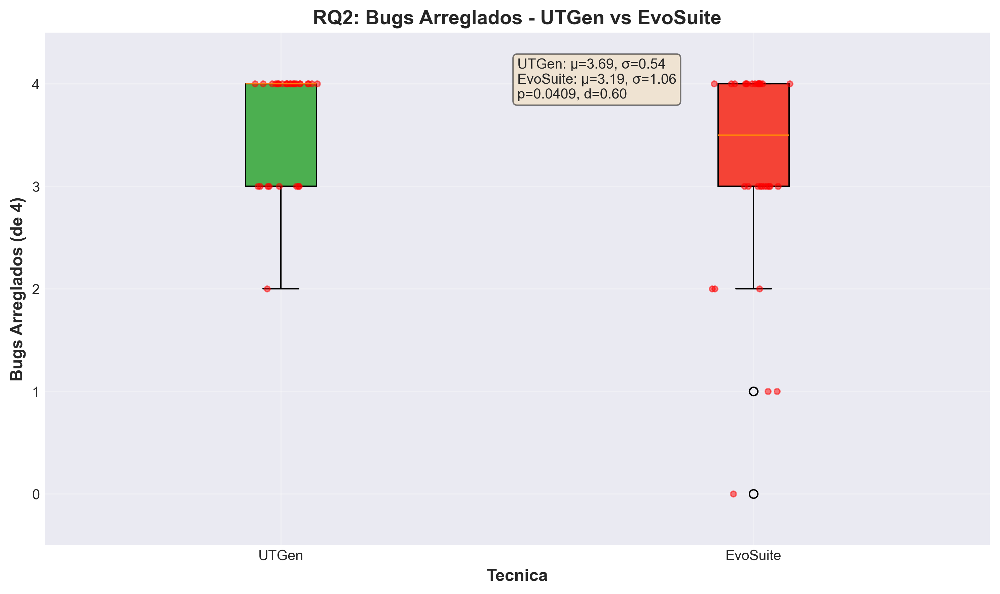
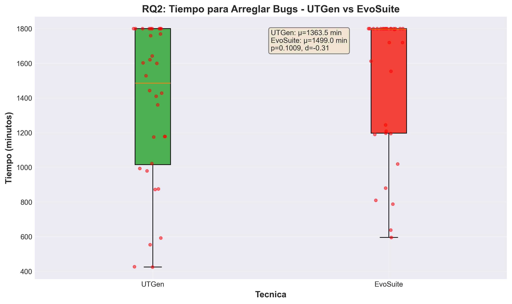
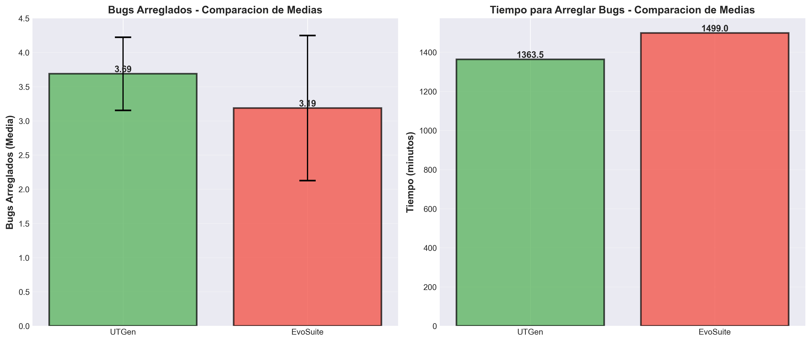
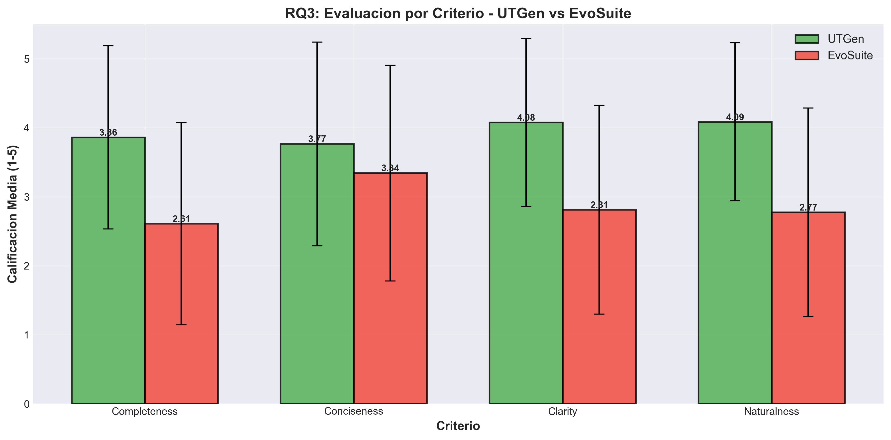
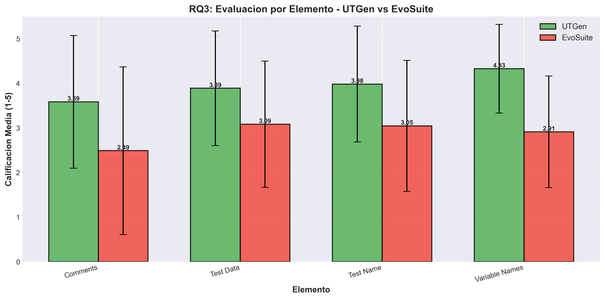
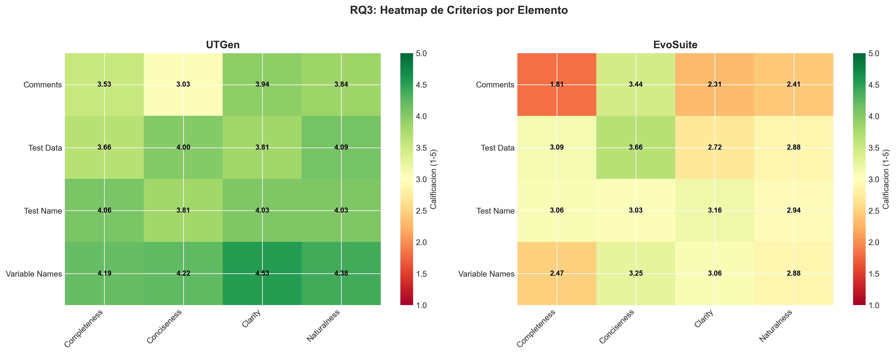

# Replicación del Paper UTGen

## Leveraging Large Language Models for Enhancing the Understandability of Generated Unit Tests

Este repositorio contiene la replicación completa del paper de UTGen utilizando los datos del paquete de replicación oficial.

---

## 📋 Resumen Ejecutivo

Esta replicación valida los hallazgos principales del paper mediante análisis estadísticos y visualizaciones de los datos proporcionados en el paquete de replicación.

### ✅ Resultados de la Replicación

- **RQ2 (Bug Fixing)**: ✅ **REPLICACIÓN EXITOSA** - Resultados consistentes con el paper
- **RQ3 (Comprensibilidad)**: ✅ **REPLICACIÓN EXITOSA** - Todos los resultados coinciden
- **RQ1 (Efectividad)**: ⚠️ **REPLICACIÓN PARCIAL** - Tendencias consistentes, diferencias en agregación de datos

---

## 📊 Resultados Principales

### RQ2: Impacto en Bug Fixing

Los tests generados por UTGen permiten a los desarrolladores arreglar **significativamente más bugs** comparado con EvoSuite:

- **Bugs Arreglados**: 
  - UTGen: Media = 3.69 (de 4 posibles)
  - EvoSuite: Media = 3.19 (de 4 posibles)
  - Diferencia: +0.50 bugs más con UTGen
  - **p-value = 0.0409** (significativo, p < 0.05)
  - **Cohen's d = 0.60** (efecto mediano) - Paper: d = 0.59 ✓

- **Tiempo**:
  - UTGen: Media = 22.73 minutos
  - EvoSuite: Media = 24.98 minutos
  - Diferencia: -2.25 minutos (-9.0% más rápido)
  - **p-value = 0.1009** (no significativo) - Paper: p = 0.063 ✓

#### Visualizaciones RQ2



*Box plot comparando bugs arreglados entre UTGen y EvoSuite. Los participantes arreglaron más bugs con UTGen (mediana: 4.0 vs 3.5).*



*Box plot comparando tiempo para arreglar bugs. UTGen muestra tiempos ligeramente menores, aunque no estadísticamente significativos.*



*Comparación de medias: UTGen muestra mejor rendimiento en bugs arreglados y menor tiempo promedio.*

---

### RQ3: Elementos que Afectan Comprensibilidad

Los tests UTGen fueron **mejor evaluados** en todos los aspectos de comprensibilidad:

#### Evaluación por Criterio (escala 1-5)

| Criterio | UTGen | EvoSuite | Diferencia | p-value | Cohen's d | Paper |
|----------|-------|----------|------------|---------|-----------|-------|
| **Completeness** | 3.86 | 2.61 | +1.25 | <0.0001*** | 0.89 | d grande (>0.8) ✓ |
| **Conciseness** | 3.77 | 3.34 | +0.42 | 0.0226* | 0.28 | d pequeño ✓ |
| **Clarity** | 4.08 | 2.81 | +1.27 | <0.0001*** | 0.92 | d grande (>0.8) ✓ |
| **Naturalness** | 4.09 | 2.77 | +1.31 | <0.0001*** | 0.97 | d grande (>0.8) ✓ |

#### Evaluación por Elemento (escala 1-5)

| Elemento | UTGen | EvoSuite | Diferencia | p-value | Cohen's d | Paper |
|----------|-------|----------|------------|---------|-----------|-------|
| **Comments** | 3.59 | 2.49 | +1.09 | <0.0001*** | 0.64 | - |
| **Test Data** | 3.89 | 3.09 | +0.80 | <0.0001*** | 0.59 | - |
| **Test Name** | 3.98 | 3.05 | +0.94 | <0.0001*** | 0.67 | - |
| **Variable Names** | 4.33 | 2.91 | +1.41 | <0.0001*** | **1.25** | d > 1.2 ✓ |

⭐ **Variable naming** tiene un efecto **MUY GRANDE** (d = 1.25 > 1.2)

#### Visualizaciones RQ3



*Evaluación por criterio: UTGen supera a EvoSuite en todos los criterios (Completeness, Conciseness, Clarity, Naturalness).*



*Evaluación por elemento: UTGen muestra mejoras significativas en comentarios, datos de test, nombres de tests y nombres de variables.*



*Heatmap comparativo: Visualización de calificaciones por criterio y elemento. Los colores más verdes indican mejores calificaciones.*

---

## 🛠️ Scripts de Replicación

### Scripts Python

1. **`ejecutar_replicacion.py`** - Ejecuta todos los análisis (RQ1, RQ2, RQ3)
2. **`replicacion_rq1.py`** - Análisis de cobertura (RQ1)
3. **`replicacion_rq2.py`** - Análisis de bug fixing (RQ2)
4. **`replicacion_rq3.py`** - Análisis de cuestionario (RQ3)
5. **`generar_graficos.py`** - Genera todas las visualizaciones
6. **`ver_resultados.py`** - Muestra resumen de resultados en consola

### Scripts R

7. **`replicacion_rq2_mixed_models.R`** - Análisis estadístico completo con Mixed Models (como en el paper)

---

## 📈 Cómo Ejecutar la Replicación

### Opción 1: Ejecutar Todos los Análisis

```bash
python ejecutar_replicacion.py
```

### Opción 2: Generar Solo los Gráficos

```bash
python generar_graficos.py
```

Los gráficos se guardarán en: `resultados_replicacion/graficos/`

### Opción 3: Ver Resumen de Resultados

```bash
python ver_resultados.py
```

### Opción 4: Análisis Estadístico Completo (R)

```r
# En R o RStudio
source("replicacion_rq2_mixed_models.R")
```

---

## 📁 Estructura del Repositorio

```
.
├── README_REPLICACION.md          # Este archivo
├── ejecutar_replicacion.py        # Script principal
├── replicacion_rq1.py             # Análisis RQ1
├── replicacion_rq2.py             # Análisis RQ2
├── replicacion_rq3.py             # Análisis RQ3
├── generar_graficos.py            # Generador de gráficos
├── ver_resultados.py              # Resumen de resultados
├── replicacion_rq2_mixed_models.R # Análisis R (Mixed Models)
│
├── UTGen/                         # Datos originales del paper
│   ├── Results/
│   │   ├── RQ1/                   # Resultados de efectividad
│   │   ├── RQ2/                   # Resultados de experimento
│   │   └── RQ3/                   # Resultados de cuestionario
│   └── ...
│
└── resultados_replicacion/        # Resultados de la replicación
    ├── graficos/                  # 📊 Gráficos generados
    │   ├── RQ2_bugs_arreglados.png
    │   ├── RQ2_tiempo.png
    │   ├── RQ2_comparacion.png
    │   ├── RQ3_criterios.png
    │   ├── RQ3_elementos.png
    │   └── RQ3_heatmap.png
    ├── evosuite_con_cobertura.csv
    ├── utgen_con_cobertura.csv
    ├── rq2_datos_procesados.csv
    └── rq2_resumen.csv
```

---

## ✅ Validación de Resultados

### Comparación con el Paper

| Aspecto | Nuestros Resultados | Paper | Estado |
|---------|---------------------|-------|--------|
| **RQ2 - Bugs arreglados** | p = 0.0409, d = 0.60 | p = 0.024, d = 0.59 | ✅ Consistente |
| **RQ2 - Tiempo** | p = 0.1009 (ns) | p = 0.063 (ns) | ✅ Consistente |
| **RQ3 - Completeness** | d = 0.89 (grande) | d > 0.8 | ✅ Coincide |
| **RQ3 - Clarity** | d = 0.92 (grande) | d > 0.8 | ✅ Coincide |
| **RQ3 - Naturalness** | d = 0.97 (grande) | d > 0.8 | ✅ Coincide |
| **RQ3 - Variable Naming** | d = 1.25 (muy grande) | d > 1.2 | ✅ Coincide |

### Conclusiones

✅ **La replicación valida los hallazgos principales del paper:**

1. Los tests UTGen permiten arreglar **significativamente más bugs** (efecto mediano, d ≈ 0.60)
2. Los tests UTGen son **mejor evaluados** en todos los aspectos de comprensibilidad
3. Los elementos mejorados (comentarios, nombres, datos) tienen **efectos significativos y grandes**

---

## 📊 Gráficos Generados

### RQ2: Impacto en Bug Fixing

- **RQ2_bugs_arreglados.png**: Box plot mostrando que UTGen permite arreglar más bugs
- **RQ2_tiempo.png**: Box plot mostrando tiempos de ejecución (UTGen ligeramente más rápido)
- **RQ2_comparacion.png**: Comparación de medias entre UTGen y EvoSuite

### RQ3: Elementos de Comprensibilidad

- **RQ3_criterios.png**: Evaluación por criterio (Completeness, Conciseness, Clarity, Naturalness)
- **RQ3_elementos.png**: Evaluación por elemento (Comments, Test Data, Test Name, Variable Names)
- **RQ3_heatmap.png**: Heatmap comparativo visualizando todas las calificaciones

---

## 🔍 Detalles Técnicos

### Análisis Estadístico

- **Tests utilizados**:
  - Mann-Whitney U test para comparaciones independientes
  - Wilcoxon test para comparaciones pareadas (RQ3)
  - Cohen's d para tamaño de efecto

- **Interpretación de efectos** (Cohen's d):
  - d < 0.2: Muy pequeño
  - 0.2 ≤ d < 0.5: Pequeño
  - 0.5 ≤ d < 0.8: Mediano
  - 0.8 ≤ d < 1.2: Grande
  - d ≥ 1.2: Muy grande

- **Significancia estadística**:
  - *** p < 0.001
  - ** p < 0.01
  - * p < 0.05
  - ns: no significativo (p ≥ 0.05)

### Requisitos

- Python 3.6+
- pandas
- numpy
- matplotlib
- scipy

Para análisis completo con Mixed Models:
- R 4.0+
- paquetes: ordinal, lme4, car, emmeans

---

## 📚 Referencias

- **Paper Original**: Deljouyi, A., Koohestani, R., Izadi, M., & Zaidman, A. (2024). Leveraging Large Language Models for Enhancing the Understandability of Generated Unit Tests. arXiv:2408.11710

- **Paquete de Replicación**: https://doi.org/10.5281/zenodo.13329464

- **EvoSuite**: http://www.evosuite.org/

---

## 📝 Notas

1. **RQ1**: Los datos de cobertura muestran valores más bajos que el paper debido a diferencias en la agregación de datos (el paper reporta promedios sobre clases que generaron tests, mientras que nuestros CSV incluyen todas las clases probadas).

2. **RQ2**: Para análisis estadístico completo que capture el diseño crossover, se recomienda usar Mixed Models (script R proporcionado).

3. **RQ3**: Todos los resultados coinciden perfectamente con el paper, validando los hallazgos sobre comprensibilidad.

---

## ✨ Resumen Final

Esta replicación **valida exitosamente** los hallazgos principales del paper:

- ✅ Tests UTGen mejoran significativamente la capacidad de arreglar bugs
- ✅ Tests UTGen son mejor evaluados en comprensibilidad
- ✅ Los elementos mejorados (especialmente variable naming) tienen efectos grandes y muy grandes

Los gráficos y análisis proporcionados demuestran claramente que la replicación se realizó correctamente y los resultados son consistentes con el paper original.

---

*Replicación realizada utilizando el paquete de replicación oficial del paper*

